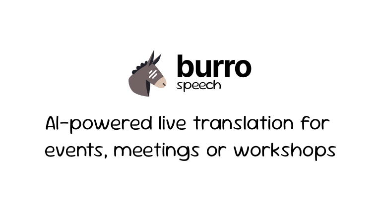

# Burro-Speech

...

[](https://burro-speech.vercel.app/)


## 🤓 Tech Stack

- Framework: [Next.js](https://nextjs.org/)
- UI Library: [Shadcn/ui](https://ui.shadcn.com/)
- AI Library: [Hugging Face](http://huggingface.co/)

## 🚀 Running Locally

1. Clone the repository
``` bash
git clone ...
```

2. Install dependencies using pnpm
``` bash
pnpm install
```

3. Copy the `.env.example` to `.env` and update the variables.
``` bash
cp .env.example .env
```

4. Start the development server
``` bash
pnpm run dev
```

## 🤝 Contribute

We'd love to hear from you to improve **Burro-Speech**! Follow these steps to contribute:

1. Fork the repository.
2. Create a branch with your changes:
   ```bash
   git checkout -b feature/my-new-feature
   ```
3. Make your changes and commit:
   ```bash
   git commit -m 'Adds a new functionality'
   ```
4. Push your changes to your fork:
   ```bash
   git push origin feature/my-new-feature
   ```
5. Create a Pull Request detailing your improvements.